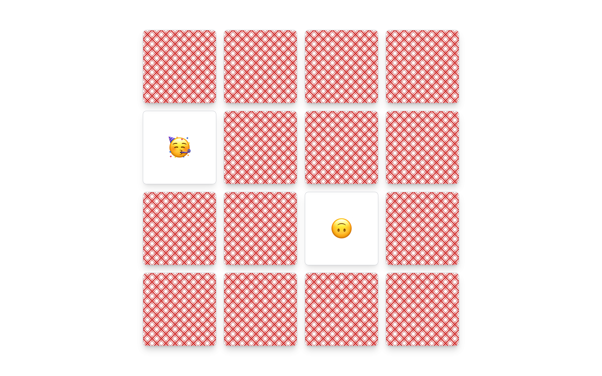

# Emoji Memory Game with SvelteKit 🎮🌈

## Overview

Emoji Memory is a fun and challenging game built with [SvelteKit](https://kit.svelte.dev/). The game features an array of emojis to test your memory skills. Try to match pairs of emojis as quickly as possible!



---

## Table of Contents

1. [Installation](#installation)
2. [Usage](#usage)
3. [License](#license)

---

## Installation

To get the project up and running, follow these steps:

1. Clone the repository:
    ```bash
    git clone git@github.com:YourUsername/EmojiMemory.git
    ```
  
2. Navigate into the project directory:
    ```bash
    cd EmojiMemory
    ```

3. Install the dependencies:
    ```bash
    npm install
    ```

4. Run the development server:
    ```bash
    npm run dev
    ```

Visit `http://localhost:5174` to see the application running!

---

## Usage

- Click on an emoji card to reveal the emoji behind it.
- Try to find its matching pair in the grid.
- Match all pairs to win the game!

---


## License

This project is licensed under the MIT License. See the [LICENSE](./LICENSE) file for details.

---

Made with 💖 by AlefAlfa
